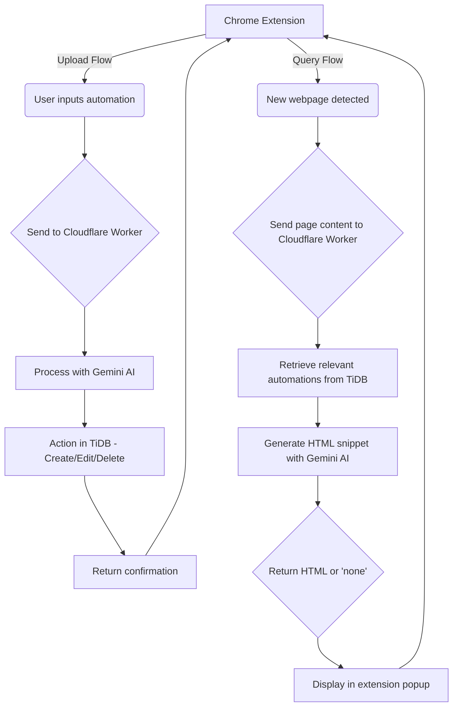

# BrassOne
Easily build automations for HTML snippets that popup with helpful information when you visit websites. Enhances your browsing experiences.

We have built an autonomous web assistant that knows your web reading preferences and generates HTML snippets accordingly. To use it you can simply open the extension when you want to create a new kind of automation. These automations could be things like:

When I visit a news article, give me a summary
Estimate reading time for articles and display it
When I visit a careers page, highlight jobs related to computer science
When I visit a Hackathon page, list the top prizes
Once automations like these have been submitted, whenever you visit a website, the AI assistant (chrome extension) will search (vector search) for automations that may apply and accordingly display helpful HTML snippets in the extension. The extension will automatically open when needed! This way, you can setup automations to gain massive productivity boosts!

## Local Installation Steps
The extension is currently under review in the Chrome Web Store. It can also be used locally by following these steps: 
1. Download this repository and remember the location of the 'Extension' folder
2. Visit chrome://extensions/
3. Switch on developer mode at top right
4. Click load unpacked
5. Select the 'Extension' folder. That's it! Your extension is now ready to use.

## Useful Reference Links
1) **Intro to TiDB and underlying mechanisms - The first links you should visit if you have never worked with TiDB.** : [TiDB dev guide overview](https://docs.pingcap.com/tidbcloud/dev-guide-overview), [TiDB Bookshop Schema example](https://docs.pingcap.com/tidbcloud/dev-guide-bookshop-schema-design)

2) **Creating a TiDB serverless cluster** - [Setting a serverless cluster in TiDB](https://docs.pingcap.com/tidbcloud/dev-guide-build-cluster-in-cloud)

3) **Connect to your serverless cluster** - [Connect to TiDB cluster](https://docs.pingcap.com/tidbcloud/connect-to-tidb-cluster-serverless, https://docs.pingcap.com/tidbcloud/serverless-driver)

4) **AI-assisted SQL Editor!** - Ctrl + I on windows - [TiDB SQL AI Assistant](https://docs.pingcap.com/tidbcloud/explore-data-with-chat2query, https://tidb.ai/)

5) **Vector Search on TiDB** - [Vector Search overview](https://docs.pingcap.com/tidbcloud/vector-search-overview), [PingCap AI](https://www.pingcap.com/ai/), [TiDB Vector Search](https://www.pingcap.com/blog/tidb-vector-search-public-beta/)

   TiDB Vector Search (beta) provides an advanced search solution for performing semantic similarity searches across various data types, including documents, images, audio, and video. This feature enables            developers to easily build scalable applications with generative artificial intelligence (AI) capabilities using familiar MySQL skills.

   Note
   TiDB Vector Search is currently in beta and only available for TiDB Serverless clusters.

6) **Types and Syntax** - [TiDB Vector Data Types](https://docs.pingcap.com/tidbcloud/vector-search-data-types), [TiDB Vector Search Index](https://docs.pingcap.com/tidbcloud/vector-search-index)

   Note
   Currently Vector data types cannot store double-precision floating numbers. This will be supported in future release.

7) **TiDB Cloud Data Service** - [TiDB Cloud Data Service](https://docs.pingcap.com/tidbcloud/data-service-overview)

   TiDB Cloud Data Service (beta) is a fully managed low-code backend-as-a-service solution that simplifies backend application development, empowering developers to rapidly build highly scalable, secure, data-      driven applications. You'll need to set up a server-side component to handle this, as Chrome extensions can't directly connect to databases. Data Service enables you to access TiDB Cloud data via an HTTPS         request using a custom API endpoint.

8) **Sample Applications** - [TiDB Past Hackathon Projects](https://ask.pingcap.com/t/sample-applications-built-with-tidb-serverless-tidb-hackathon-2024/938), [TiDB GPT App](https://www.youtube.com/watch?v=qGvUkdU91vw)

9) **Embeddings** -  [Google AI Embeddings](https://ai.google.dev/gemini-api/docs/embeddings), [Embeddings Document Search](https://ai.google.dev/gemini-api/tutorials/document_search)

10) **Cloudflare Worker Wrangler Docs** - [Wrangler Docs](https://developers.cloudflare.com/workers/wrangler/install-and-update/)

11) **Other resources** - [Link](https://tidbhackathon2024.devpost.com/resources)

------
Special thanks to the TiDB team for the clear documentation and super-helpful tools like the AI-SQL Editor which make development so much faster!
